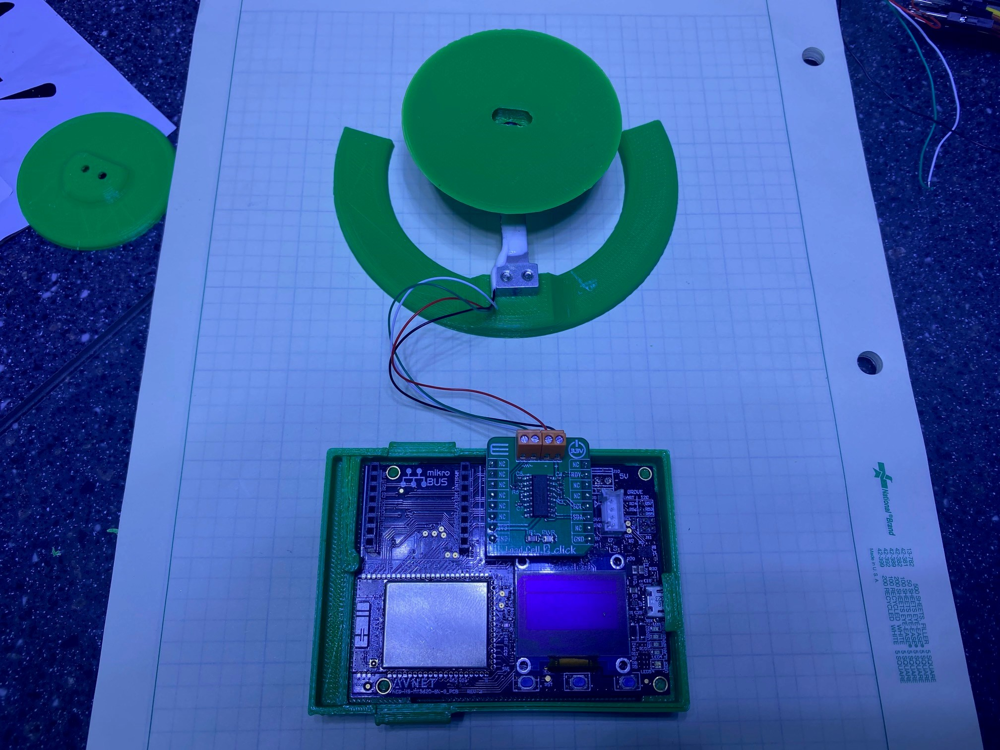
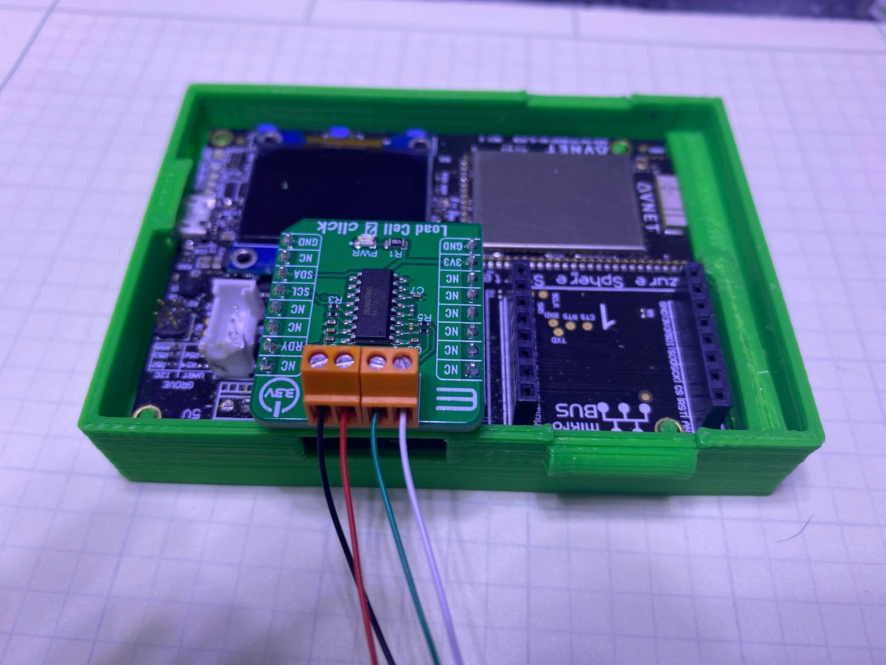
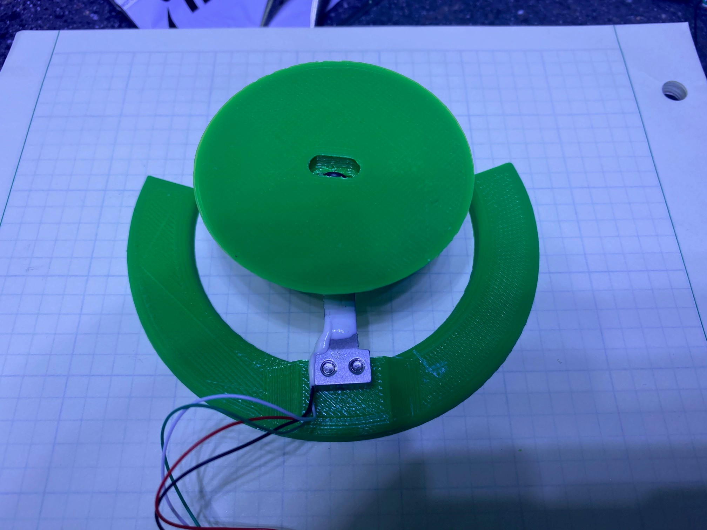
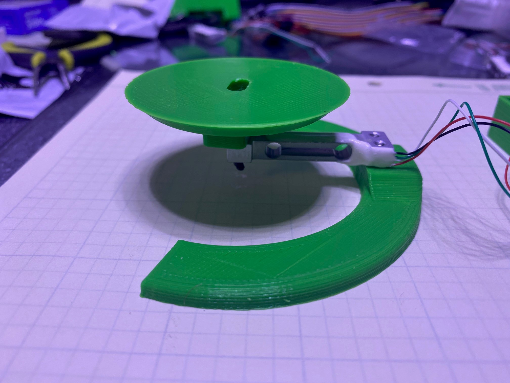

## Sample: I2C_LSM6DS3_HighLevelApp

This sample Azure Sphere application uses a MikroE Load Cell 2 Click board and a TAL221 Load Cell to implement a weigh scale on an Avnet Azure Sphere Starter Kit.



## Prerequisites

This sample requires the following hardware:

* Avnet Azure Sphere Starter Kit: [Product Link](https://www.avnet.com/shop/us/products/avnet-engineering-services/aes-ms-mt3620-sk-g-3074457345636825680/)
* Load Cell 2 Click Board: [Product Link](https://www.mikroe.com/load-cell-2-click)
* TAL221 Load Cell: [Product Link](https://www.sparkfun.com/products/14727)

   **NOTE:** By default, this sample targets the Avnet Azure Sphere Starter Kit Rev1 hardware. To build the sample for different Azure Sphere hardware, change the Target Hardware Definition Directory in the CMakeLists.txt file. For detailed instructions, see the [README file in the HardwareDefinitions folder](../../../HardwareDefinitions/README.md). You might also need to wire the boards differently; check with your hardware manufacturer for details.

## Connect the Load Cell board to your Starter Kit

Since we're using the Avnet Azure Sphere Starter Kit and a Click board, all we need to do is plug the Load Cell 2 Click board into click socket #2.

## Connect the TAL221 Load Cell to the Load Cell 2 Click board

To connect to TAL221 to your click board you need to identify the wire pairs.  This can be done with a multimeter.  You want to find the pairs with the highest resistance.  For my device I found that measuring between the (red/black) and (green/white) pairs showed a resistance of ~1k ohms.  Once you have the pairs identified, put one pair on the "+" "-" terminal and the other pair on the reisitor terminal.  Don't worry you won't harm the device if you hook it up wrong. 

When you run the application, there is a check to see if the reading is inverse, if so there will be a debug print stating to reverse one set of wires.  This just means you need to swap the wires in one of the pairs.  For example, on my device one pair is made up of the red/black wires.  I just swap the red and black wires in the terminal block and all is well. 

If you're interested in why this works, you can read up on Wheatstone Bridge circuits.  There's tons of information avaliable on the topic.



## Build and run the sample

To build and run this sample, follow the instructions in [Build a sample application](../../../BUILD_INSTRUCTIONS.md).

## Test the sample

The application is driven by button A, the center button on the Starter Kit.  The first time you press the button, the application will walk the user through the calibration step, then a weight will be taken on each subsequent button press.  You need to have a 50 gram calibration weight ready for the calibration step.  If you have a different calibration weight you can change the code to specifiy your calibration weight.

To change the calibration weight, look for the LOADCELL2_WEIGHT_50G constant ~line 195 in main.c.  Change that to another supported constant, or modify the application for your own custom calibration weight!

## 3D printed load cell Jig

You can download and print my load cell jig by downloading the files from (Add url here).




## Sample Debug with comments

```
Remote debugging from host 192.168.35.1, port 63702
I2C Load Cell application starting.
Open Data Ready GPIO 34 as input.
Open SAMPLE_BUTTON_1 as input.

Press button A to start scale calibration

Remove all objects from the scale
Tare will commence in 10 seconds
Tare will commence in 9 seconds
Tare will commence in 8 seconds
Tare will commence in 7 seconds
Tare will commence in 6 seconds
Tare will commence in 5 seconds
Tare will commence in 4 seconds
Tare will commence in 3 seconds
Tare will commence in 2 seconds
Tare will commence in 1 seconds

tare the scale

Calibrating the Scale
Place 50g weight on the scale
Calibration will commence in 10 seconds
Calibration will commence in 9 seconds
Calibration will commence in 8 seconds
Calibration will commence in 7 seconds
Calibration will commence in 6 seconds
Calibration will commence in 5 seconds
Calibration will commence in 4 seconds
Calibration will commence in 3 seconds
Calibration will commence in 2 seconds
Calibration will commence in 1 seconds

***** Calibration complete! *****
Remove calibration weight from the scale
To use scale, place item on scale and press button A
Weight: 0 g  // Empty Scale
Weight: 50 g // Calibration Weight on Scale
Weight: 59 g // Tape measure on Scale
Weight: 329 g // Cell phone on Scale
```

## List of potential improvements

* Capture the calibration values and store them in persistant memory
* Add an Aure IoT Hub connection and implement direct methods to trigger calibration
* Your idea here . . .
