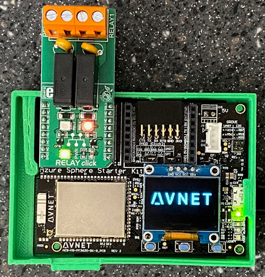

# Sample: Avnet Azure Sphere Methane Click Board Example Application

This sample application was developed to demonstrate the Avnet Azure Sphere Starter Kit with a MikroE Methane Click board.  The application was built using the Microsoft AzureIoT example as a starting point.

The Starter Kit is available for order [here](http://avnet.me/mt3620-kit).



## Application Features

* Supports multiple Azure Connectivity options
   * No Azure Connection (reads on-board sensors and outputs data to debug terminal)
   * IoT Hub Connection using the Azure Device Provisioning Service
   * IoT Hub Connection using the direct connection method
   * IoT Hub Connection with Azure Plug and Play (PnP) functionality
   * Avnet IoTConnect Platform Connection

### Sensors

* Reads the ADC value from a Methane Click Board
 
### Button Features

The Avnet Starter Kit includes two user buttons, ButtonA and ButtonB

* When using the optional OLED display
   * Button A: Move to the last OLED screen
   * Button B: Move to the next OLED screen

### Connected Features

**IMPORTANT**: For all **connected** build options this application requires customization before it will compile and run. Follow the instructions in this README and in IoTCentral.md and/or IoTHub.md and/or IoTEdge.md to perform the necessary steps.

* Sends sensor readings up as telemetry
* Implements Device Twins
   * Control all user LEDs
   * Configure custom message to display on an optional OLED display
* Implements two direct methods
   * setSensorPollTime: Modifies the period (in seconds) between reading the on-board sensors and sending telemetry messages
   * rebootDevice: Forces the device to execute a reboot
* Sends button press events as telemetry
   
### Optional Hardware

The application supports the following optional hardware to enhance the example
* [0.96" I2C OLED LEC Display](https://www.amazon.com/gp/product/B06XRCQZRX/ref=ppx_yo_dt_b_search_asin_title?ie=UTF8&psc=1)
   * Verify that the pinout for your display matches the pinout on the Starter Kit
* [Relay Click Board](https://www.mikroe.com/relay-click)

## Build Options

The application can be configured for multiple different deployments.  Build options are defined in the build_options.h header file.  To enable an option remove the comment delimiters ```//``` before the ```#define``` statement. 

### IOT_HUB_APPLICATION
* Enble for IoTCentral, IoTHub and IoTEdge connected functionality

### USE_PNP
* Enable to use the Azure IoTHub Plug and Play functionality
* When using the PnP build
   * Setup your Azure Resources as you would for a DPS connectoin
   * Update the command line argement in the app_manifest.json file to specify "PnP" instead of "DPS"
      * ```"CmdArgs": [ "--ConnectionType", "PnP", "--ScopeID", "<your scope ID>" ],```

### USE_IOT_CONNECT
* Enable to include the functionality required to connect to Avnet's IoTConnect platform

### OLED_1306
* Enable to include the functionality required to drive the optional OLED display

## WiFi or Ethernet
Before you can run the sample, you must configure either an Azure IoT Central application or an Azure IoT Hub, and modify the sample's application manifest to enable it to connect to the Azure IoT resources that you configured.

By default, this sample runs over a Wi-Fi connection to the internet. To use Ethernet instead, make the following changes:

1. Configure Azure Sphere as described in [Connect Azure Sphere to Ethernet](https://docs.microsoft.com/azure-sphere/network/connect-ethernet).
1. Add an Ethernet adapter to your hardware. If you are using an MT3620 RDB, see the [wiring instructions](../../HardwareDefinitions/mt3620_rdb/EthernetWiring.md).
1. Add the following line to the Capabilities section of the app_manifest.json file:

   `"NetworkConfig" : true`

1. In main.c, ensure that the global constant networkInterface is set to "eth0". In source file AzureIoT/main.c, search for the following line:

   `static const char networkInterface[] = "wlan0";`

   and change it to:

   `static const char networkInterface[] = "eth0";`

1. In main.c, add the following lines before any other networking calls:

    ```c
     int err = Networking_SetInterfaceState("eth0", true);
     if (err == -1) {
           Log_Debug("Error setting interface state %d\n",errno);
           return -1;
       }
    ```
## Prerequisites

The sample requires the following software:

- Azure Sphere SDK version 21.01 or higher. At the command prompt, run **azsphere show-version** to check. Install [the Azure Sphere SDK](https://docs.microsoft.com/azure-sphere/install/install-sdk), if necessary.
- An Azure subscription. If your organization does not already have one, you can set up a [free trial subscription](https://azure.microsoft.com/free/?v=17.15).

## Preparation

**Note:** By default, this sample targets the [Avnet Azue Sphere Starter Kit Rev1](http://avnet.me/mt3620-kit) board. To build the sample for the Rev2 board, change the Target Hardware Definition Directory in the CMakeLists.txt file.

* Rev1: ```azsphere_target_hardware_definition(${PROJECT_NAME} TARGET_DIRECTORY "../../../HardwareDefinitions/avnet_mt3620_sk" TARGET_DEFINITION "sample_appliance.json")```
* Rev2: ```azsphere_target_hardware_definition(${PROJECT_NAME} TARGET_DIRECTORY "../../../HardwareDefinitions/avnet_mt3620_sk_rev2" TARGET_DEFINITION "sample_appliance.json")```

1. Set up your Azure Sphere device and development environment as described in [Azure Sphere documentation](https://docs.microsoft.com/azure-sphere/install/overview).
1. Clone the Azure Sphere Samples repository on GitHub and navigate to the Samples/AvnetAzureSphereHacksterTTC/HighLevelExampleApp folder.
1. Connect your Azure Sphere device to your computer by USB.
1. Enable a network interface on your Azure Sphere device and verify that it is connected to the internet.
1. Open an Azure Sphere Developer Command Prompt and enable application development on your device if you have not already done so:

   **azsphere device enable-development**

## Run the sample

- [Run the sample with Azure IoT Central](./IoTCentral.md)
- [Run the sample with an Azure IoT Hub](./IoTHub.md)
- [Run the sample with an IoT Edge device](./IoTEdge.md)
